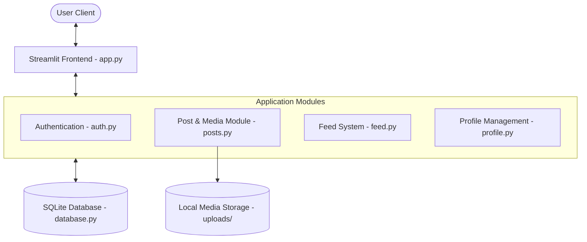

# SnapShare – Designing a Scalable Photo Sharing Application Like Instagram

SnapShare is a fully functional, premium-designed academic System Design Final Examination Project. It implements an Instagram-like photo-sharing platform featuring image uploads, automatic compression and resizing pipelines, relational SQLite tracking (users, posts, comments, likes, follower graphs, notifications), chronological feed assemblies, and personalized explore feeds.

---

## 🚀 Project Overview

The primary objective of this project is to model a real-world, high-scale social application utilizing clean software engineering practices:
- **Presentation Layer:** Built with **Streamlit** using custom Glassmorphism CSS, styled dark mode interfaces, and mobile-friendly grid layouts.
- **Application Layer:** Decoupled Python services separating user authentication (`auth.py`), feed generators (`feed.py`), profiles (`profile.py`), and media compression services (`posts.py`).
- **Database Layer:** A relational **SQLite** backend with secondary indexes, foreign keys, constraints, and custom SQL query implementations (`database.py`).
- **Media Engine:** Image transformation pipelines leveraging **Pillow** to perform lossy JPEG compression and resolution resizing to save bandwidth.

---

## ✨ Features

1. **User Authentication:** 
   - Secure sign up with alphanumeric constraints and email verification format regexes.
   - Salted SHA-256 password hashing to protect against rainbow table attacks.
   - Session tracking through Streamlit state variables.

2. **Media Pipeline:**
   - Multi-format file uploader (JPG, JPEG, PNG).
   - Dynamic size checks and format unification (conversion of PNG/RGBA to standard RGB JPEG).
   - Aspect-ratio-preserving downsizing to 1080px width max.
   - Quality compression (75%) leading to file size reductions of up to 70%.

3. **Feed Engines:**
   - **Chronological Feed:** Renders posts from users you follow + own posts, sorted by `created_at DESC`.
   - **Explore Feed:** Global real-time stream of all posts across the platform.
   - **Personalized Trending Feed:** Employs an engagement algorithm to rank posts dynamically: `Score = (likes_count + comments_count * 2.0)`.

4. **Social Graph & Activity:**
   - Follow and unfollow systems updating profile follower/following counters.
   - Interactive comment threads attached to each post.
   - Like button with state checks.

5. **Notification Center:**
   - Live inbox showing unread notifications badge count on sidebar.
   - Tracks likes, comments, and new followers with linkable expandable post previews.

---

## 🛠️ Technology Stack

- **Language:** Python 3.9+
- **Frontend/UI:** Streamlit Web Framework with custom CSS overrides (Glassmorphism design, Outfits font family, sleek linear gradients).
- **Database Engine:** SQLite (Local database node `snapshare.db`).
- **Media Processing:** Pillow (PIL Image Library).
- **Data Structuring:** Pandas (for internal stats and listings).

---

## 📂 Repository Structure

```directory
SnapShare/
│
├── app.py                 # Main entry point, page routing & CSS injection
├── database.py            # SQLite schema initialization and DB operations
├── auth.py                # Registration, login verify, SHA-256 hashing
├── posts.py               # Image compression, resizing & file uploads
├── feed.py                # Social cards layout & feed list rendering
├── profile.py             # User profile banners, counts & posts grids
│
├── requirements.txt       # Python packages dependencies
├── README.md              # Project manual and architecture guide
├── system_design_report.md# Complete 17-chapter Academic Project Report
└── viva_prep.md           # 50 Viva Questions & Answers for exam preparation
```

---

## ⚙️ Setup and Installation

### 1. Prerequisites
Ensure you have Python 3.9 or higher installed on your computer.

### 2. Clone/Extract the Project
Navigate to the project root directory:
```bash
cd /Users/ragini/Desktop/SnapShare
```

### 3. Install Dependencies
Install the required packages using pip:
```bash
pip install -r requirements.txt
```

### 4. Run the Streamlit Application
Start the local development server:
```bash
streamlit run app.py
```

Open `http://localhost:8501` in your browser.

---

## 🛡️ Architecture Highlights

### High-Level Local Implementation


### Production Scalable Architecture
In production, SnapShare is designed to scale horizontally:
1. **API Gateway / Load Balancer:** Distributes traffic across auto-scaled stateless microservices.
2. **Redis Cache:** Powers the personalized user feeds using pre-computed timelines.
3. **AWS S3 & CloudFront CDN:** Offloads image hosting, providing low-latency asset serving globally.
4. **PostgreSQL Clustering:** Supports multi-region reads and replication.

---

## 🔮 Future Scope

- **Asynchronous Feed Generation:** Implement a Fan-out write model using Celery workers to push posts to follower feeds proactively.
- **Relational Partitioning:** Move from SQLite to PostgreSQL with vertical partitioning for comments and likes tables.
- **Distributed Cache:** Implement Redis caching for user sessions and trending engagement metrics.
- **Real-time Messaging:** Integrate WebSocket channels to support instant messaging between users.
