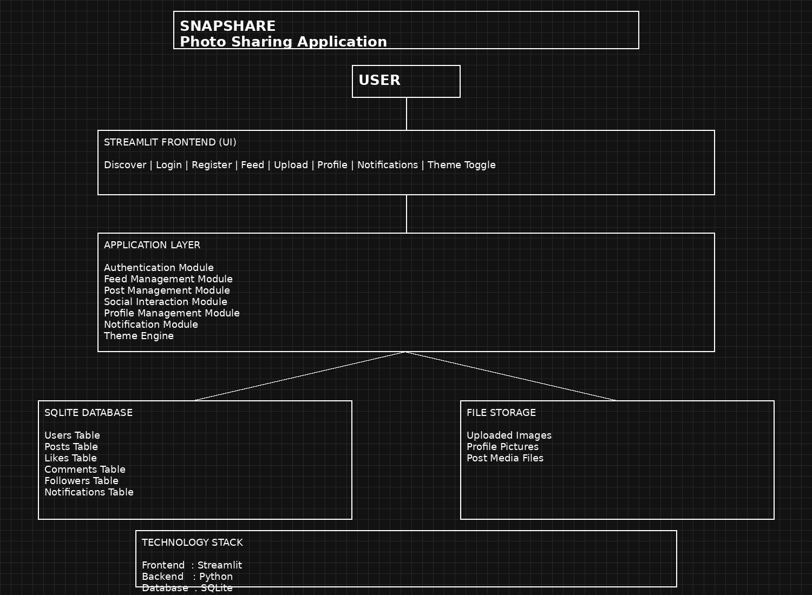

# 📸 SnapShare – Designing a Scalable Photo Sharing Application Like Instagram

SnapShare is a full-stack social media platform designed to demonstrate real-world system design concepts including user authentication, media management, social interactions, notification systems, profile management, database design, and scalable application architecture.

**Technology Stack:** Streamlit • Python • SQLite • Custom CSS • GitHub

---

<div align="center">

## 🔗 Quick Access

</div>

<p align="center">

<a href="https://snapshare-photo-sharing-application-98lhmr5fzvwqsicdcedjuy.streamlit.app/">

</a>

<a href="https://docs.google.com/document/d/1SfZv1fz5rc_DjhuVs2EIVloONnMHDBQg74Tt_u2oBpM/edit?usp=sharing">

</a>

<a href="SnapShare_Final_Architecture.png">

</a>

<a href="architecture.md">

</a>

<a href="https://github.com/RaginiSingh2024/SnapShare-Photo-Sharing-Application">

</a>

</p>

</div>

---

## 🏗️ System Architecture



---

# 📖 Project Overview

SnapShare is a fully functional social media photo-sharing platform inspired by modern applications like Instagram.

The system allows users to create accounts, upload photos, interact through likes and comments, follow other users, receive notifications, and manage personalized profiles through a premium user interface.

The project demonstrates complete System Design concepts including:

- Frontend Development
- Backend Logic
- Database Design
- File Storage Management
- Authentication System
- Social Interaction Modules
- Notification Management
- System Architecture Planning

---

# ✨ Features

## 🔐 Authentication Module

- User Registration
- Secure Login
- Password Hashing
- Session Management
- Input Validation

## 📸 Media Upload Module

- Upload Images
- Image Compression
- Image Resizing
- JPEG Conversion
- Storage Optimization

## 📰 Feed Management

- Discover Feed
- Personalized Feed
- Chronological Post Ordering
- Trending Content

## ❤️ Social Interaction

- Like Posts
- Unlike Posts
- Add Comments
- Follow Users
- Unfollow Users

## 👤 Profile Management

- View Profile
- Edit Profile
- Update Profile Picture
- User Statistics

## 🔔 Notification System

- Like Notifications
- Comment Notifications
- Follow Notifications
- Notification Center

## 🎨 Theme Engine

- Dark Mode
- Light Mode
- Dynamic UI Switching
- Custom CSS Styling

---

# 🗄 Database Design

### Users Table

| Field |
|---------|
| user_id |
| username |
| email |
| password |
| bio |
| profile_picture |
| created_at |

### Posts Table

| Field |
|---------|
| post_id |
| user_id |
| image_path |
| caption |
| created_at |

### Likes Table

| Field |
|---------|
| like_id |
| user_id |
| post_id |
| created_at |

### Comments Table

| Field |
|---------|
| comment_id |
| user_id |
| post_id |
| comment |
| created_at |

### Followers Table

| Field |
|---------|
| follower_id |
| following_id |
| created_at |

### Notifications Table

| Field |
|---------|
| notification_id |
| user_id |
| actor_id |
| type |
| post_id |
| created_at |

---

# ⚙ Technology Stack

| Component | Technology |
|------------|------------|
| Frontend | Streamlit |
| Backend | Python |
| Database | SQLite |
| Storage | Local Upload Folder |
| Styling | Custom CSS |
| Image Processing | Pillow |
| Version Control | GitHub |

---

# 📂 Project Structure
```text
SnapShare/
│
├── app.py
├── auth.py
├── database.py
├── feed.py
├── posts.py
├── profile.py
├── themes.py
│
├── uploads/
│
├── snapshare.db
├── requirements.txt
├── README.md
│
├── SnapShare_Final_Architecture.png
└── system_design_report.pdf
```

# 🚀 Installation

## Clone Repository

```bash
git clone https://github.com/RaginiSingh2024/SnapShare-Photo-Sharing-Application.git
```

## Move Into Project

```bash
cd SnapShare-Photo-Sharing-Application
```

## Install Dependencies

```bash
pip install -r requirements.txt
```

## Run Application

```bash
streamlit run app.py
```

Application will start at:

```text
http://localhost:8501
```

# 🔒 Security Features

- SHA-256 Password Hashing
- Session-Based Authentication
- Input Validation
- File Type Validation
- Secure User Registration

---

# 🔮 Future Scope

- Real-Time Chat System
- AI-Based Content Recommendation
- Story Feature
- Video Upload Support
- Cloud Storage Integration
- Mobile Application
- Redis Caching
- PostgreSQL Migration

---

# 👩‍💻 Author

**Ragini Singh**

B.Tech Computer Science Engineering

System Design Final Examination Project

2025-26 Academic Year

---

# ⭐ GitHub Repository

https://github.com/RaginiSingh2024/SnapShare-Photo-Sharing-Application

If you found this project useful, please consider giving it a ⭐.
