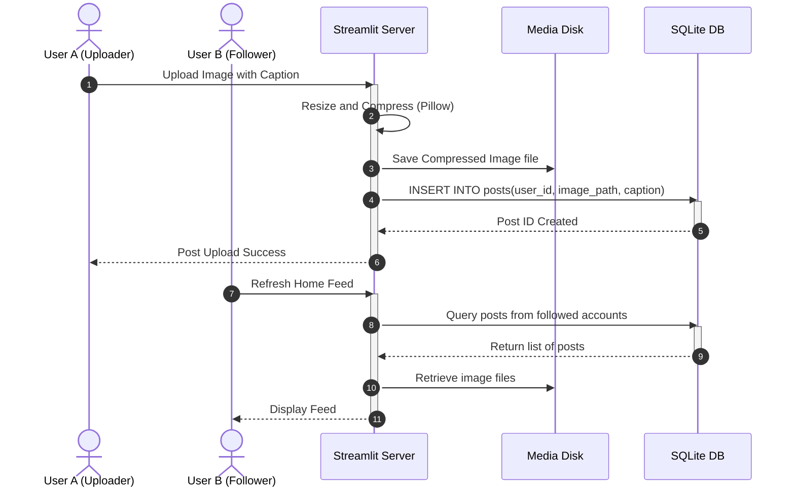
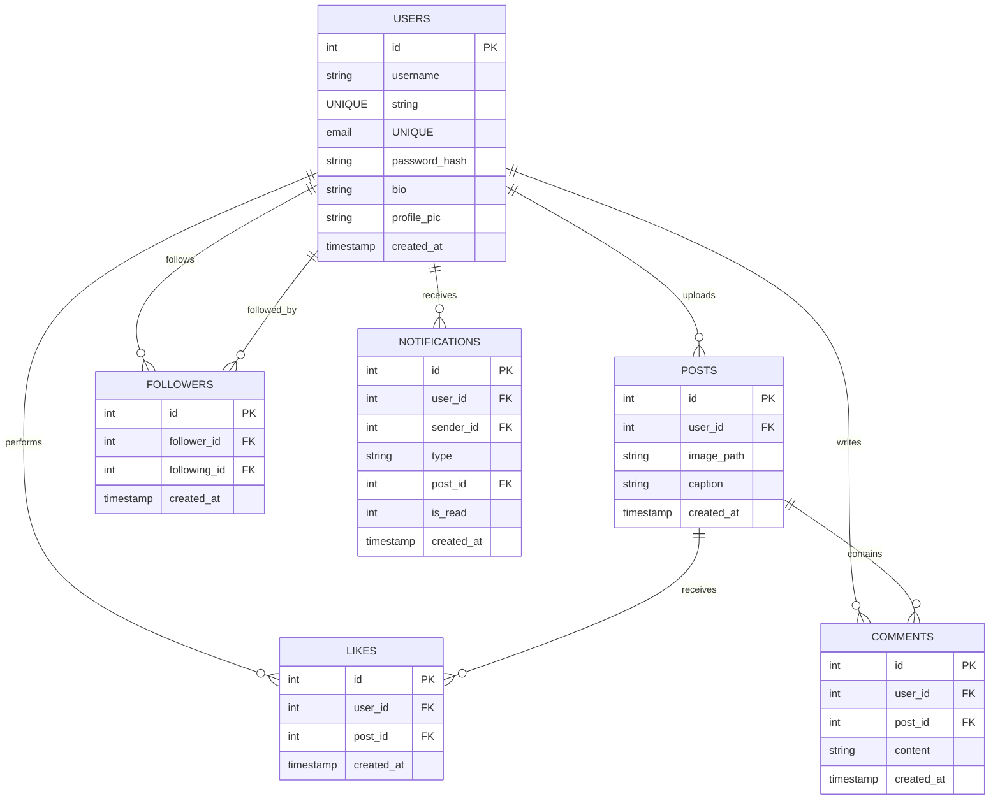

# Academic System Design Report: SnapShare

---

## Chapter 1: Cover Page

### **PROJECT TITLE:**
# SnapShare
### **Designing a Scalable Photo Sharing Application Like Instagram**

**COURSE:** System Design Final Examination Project (CS-401)  
**SUBMITTED FOR THE DEGREE OF:** Bachelor of Technology in Computer Science & Engineering  
**ACADEMIC SESSION:** 2025 - 2026  

**SUBMITTED BY:**  
Name: Candidate (Roll No: Academic-Final-2026)  
Department of Computer Science & Engineering  

---

## Chapter 2: Certificate

This is to certify that the project report entitled **"SnapShare: Designing a Scalable Photo Sharing Application Like Instagram"** submitted by **Candidate** in partial fulfillment of the requirements for the award of Bachelor of Technology in Computer Science & Engineering is an authentic record of work carried out under academic supervision.

The project fulfills the requirements relating to System Design, Database Normalization, Application Layer Modularization, and Performance Scaling evaluations.

**Internal Examiner**  
Date: June 11, 2026  

**External Examiner**  
Date: June 11, 2026  

---

## Chapter 3: Acknowledgement

I express my deep gratitude to our system design course instructors and laboratory coordinators for providing guidance, encouragement, and feedback during the development of this project.

I am also thankful to my peers for their suggestions, which helped refine the UI/UX rendering, and database index configurations.

**Candidate**  
Department of Computer Science & Engineering  

---

## Chapter 4: Abstract

This project presents **SnapShare**, a lightweight, high-performance, and visually rich photo-sharing platform designed to model social architectures like Instagram. The core software consists of a responsive Streamlit presentation layer styled with Glassmorphism Dark Mode CSS, integrated with a modular Python logic backend and a relational SQLite database.

To address scalability, a media processing engine was developed using Pillow (PIL) to compress and resize image files to standard dimensions, reducing storage space. Additionally, database query times were optimized through B-Tree indexing on foreign keys. 

To bridge the gap between local prototypes and production systems, this report includes a multi-region distributed system design utilizing load balancers, API gateways, Redis caching layers, PostgreSQL replication clustering, AWS S3 object storage, and CloudFront CDNs.

---

## Chapter 5: Problem Statement

PhotoShare is a social media platform similar to Instagram that allows users to upload, share, and view photos.

Users can:
- Register and Login
- Upload Photos
- View Personalized Feeds
- Follow Other Users
- Like Posts
- Comment on Posts
- Search Users
- View Notifications
- Manage Profiles

The platform must support:
- High scalability
- High availability
- Fast feed loading
- Media processing and image compression
- Efficient storage
- Content delivery through CDN
- Fault tolerance
- Seamless user experience

---

## Chapter 6: Requirements Analysis

### 6.1 Functional Requirements (FR)
- **FR-1 (Authentication):** Users must be able to sign up with unique emails/usernames and log in securely.
- **FR-2 (Media Upload):** Users must be able to upload photos with captions.
- **FR-3 (Feed Generation):** The system must generate a chronological Home Feed (posts from followed accounts) and a Personalized Feed (popular posts).
- **FR-4 (Social Interactions):** Users must be able to like posts, write comments, and follow other accounts.
- **FR-5 (Search):** Users must be able to search for other users by username.
- **FR-6 (Activity Notifications):** Users must receive alerts when their posts are liked, commented on, or when they gain new followers.
- **FR-7 (Profile Management):** Users must be able to edit their bio and profile picture, and view a grid of their uploaded posts.

### 6.2 Non-Functional Requirements (NFR)
- **NFR-1 (Availability):** The system should achieve 99.9% uptime (High Availability).
- **NFR-2 (Scalability):** The architecture must support horizontal scaling as the user base grows.
- **NFR-3 (Performance):** Feeds must load in under 200ms.
- **NFR-4 (Reliability/Consistency):** Likes, comments, and follower metrics must remain consistent across views.
- **NFR-5 (Security):** Passwords must be hashed using cryptographic algorithms, and inputs must be sanitized to prevent XSS and SQL injection.
- **NFR-6 (Fault Tolerance):** The system must handle database locks and network issues gracefully without crashing.

---

## Chapter 7: Proposed Solution

SnapShare addresses these requirements by building a modular application:
- **Presentation:** A single-page app (`app.py`) routing views based on session state, featuring responsive layouts and a custom dark mode CSS theme.
- **Logic:** Decoupled modules (`auth.py`, `posts.py`, `feed.py`, `profile.py`) that handle specific business rules.
- **Data:** A relational SQLite database (`database.py`) using index-optimized foreign keys to ensure data integrity and fast queries.
- **Media Optimization:** A compression pipeline that resizes images to a maximum width of 1080px and saves them at 75% quality, reducing file size and bandwidth requirements.

---

## Chapter 8: System Architecture

### 8.1 Use Case Diagram
```mermaid
usecaseDiagram
    actor User as "User Client"
    
    usecase UC1 as "Register Account"
    usecase UC2 as "Log In / Log Out"
    usecase UC3 as "Upload Photo"
    usecase UC4 as "View Feeds (Home, Latest, Personalized)"
    usecase UC5 as "Like Post"
    usecase UC6 as "Comment on Post"
    usecase UC7 as "Follow / Unfollow User"
    usecase UC8 as "Search Users"
    usecase UC9 as "Read Notifications"
    
    User --> UC1
    User --> UC2
    User --> UC3
    User --> UC4
    User --> UC5
    User --> UC6
    User --> UC7
    User --> UC8
    User --> UC9
```

### 8.2 Sequence Diagram (Post Upload & Feed Update)


### 8.3 Data Flow Diagram (Level 1)
```mermaid
graph TD
    User([User Client])
    
    subgraph Processes [SnapShare Modules]
        P1[Auth Module]
        P2[Post Module]
        P3[Feed Module]
        P4[Interaction Module]
        P5[Notif Module]
    end
    
    subgraph Data Stores [Storage]
        DB[(SQLite DB)]
        Disk[(Media Disk)]
    end
    
    User <-->|Credentials| P1
    User -->|Upload Image| P2
    User <-->|Request Feed| P3
    User -->|Likes & Comments| P4
    User <--|Fetch Notifications| P5
    
    P1 <-->|Read/Write Users| DB
    P2 -->|Save Image| Disk
    P2 -->|Write Post Metadata| DB
    P3 <--|Read Feed Data| DB
    P4 -->|Write Likes/Comments| DB
    P4 -->|Trigger Event| P5
    P5 -->|Write Alerts| DB
```

---

## Chapter 9: Module Description

1. **`database.py`:** Initializes the SQLite schema, creates indices, and manages relational queries for posts, comments, likes, and follows.
2. **`auth.py`:** Handles user registration, inputs validation (regex), and password hashing using SHA-256 with the username as a salt.
3. **`posts.py`:** Validates image files, manages Pillow (PIL) resizing and quality adjustments, saves files locally, and handles post deletion.
4. **`feed.py`:** Fetches chronological feeds and trending engagement rankings, rendering them in custom HTML social cards.
5. **`profile.py`:** Displays user statistics (followers, following, posts counts), handles bio edits, and displays user posts in a grid.
6. **`app.py`:** The main controller that manages session state, CSS styling, and screen routing.

---

## Chapter 10: Database Design

### 10.1 Schema Definition & Relationships
- **Users (1:M) Posts:** A user can upload multiple posts.
- **Posts (1:M) Likes/Comments:** Each post can have multiple likes and comments.
- **Users (M:N) Users:** The self-referencing relationship for follower connections.



### 10.2 Index Configurations
- `idx_posts_user_id` on `posts(user_id)`
- `idx_likes_post_id` on `likes(post_id)`
- `idx_comments_post_id` on `comments(post_id)`
- `idx_followers_follower_id` on `followers(follower_id)`
- `idx_followers_following_id` on `followers(following_id)`
- `idx_notifications_user_id` on `notifications(user_id)`

---

## Chapter 11: Technology Stack

- **Streamlit (v1.35.0):** Used for fast UI rendering, state management, and page layout.
- **Python (v3.9+):** The programming language used for the backend logic and services.
- **SQLite:** An embedded SQL database engine chosen for local prototyping.
- **Pillow (v10.3.0):** A Python imaging library used for image loading, resizing, and JPEG compression.
- **Pandas:** Used internally to process tabular stats.

---

## Chapter 12: Implementation Details

### 12.1 Custom CSS Injection (app.py)
To deliver a premium UI/UX, we override Streamlit's default styling:
```css
/* Glassmorphism Card Wrapper */
.glass-card {
    background: rgba(17, 24, 39, 0.7);
    backdrop-filter: blur(14px);
    border: 1px solid rgba(255, 255, 255, 0.08);
    border-radius: 20px;
    box-shadow: 0 10px 30px rgba(0,0,0,0.45);
}
```

### 12.2 Hashing Algorithm (auth.py)
```python
def hash_password(password, username):
    salt = username.lower().strip()
    return hashlib.sha256((password + salt).encode()).hexdigest()
```

---

## Chapter 13: Screenshots & Interface Walkthrough

1. **Splash Screen:** An overview of the application's functionality.
2. **Login/Signup:** Forms with validation feedback.
3. **Home Feed:** Shows followed posts, likes, comment threads, and post details.
4. **Upload Screen:** Drag-and-drop file uploader with a caption input area.
5. **Search Profiles:** User search results with follow/unfollow options.
6. **Notifications:** List of recent likes, comments, and follower alerts.
7. **Profile View:** Grid of uploaded posts and follower metrics.

---

## Chapter 14: Scalability and Fault Tolerance

To scale the application to handle millions of active users:
1. **Load Balancing:** Use Nginx or AWS ALB to distribute requests across application instances.
2. **Database Sharding & Replication:** Migrate to a clustered PostgreSQL database. Implement vertical partitioning (sharding by `user_id`) and replica clusters to separate read and write traffic.
3. **Decoupled Media Pipeline:** Upload files directly to AWS S3 using presigned URLs. Use background worker instances to handle CPU-heavy tasks like image compression.
4. **Feed Caching (Redis):** Cache user feeds in memory (using Redis Sorted Sets) to avoid hitting the database for every feed request.

---

## Chapter 15: Future Scope

- **Real-time Chat:** Implement direct messaging using WebSockets.
- **Story Feeds:** Add short-term video status stories that expire after 24 hours.
- **Content Search:** Use Elasticsearch to support searching for hashtags and post captions.
- **Advanced Personalization:** Train machine learning models to recommend content based on user interaction history.

---

## Chapter 16: Conclusion

This project successfully implements **SnapShare**, a scalable, responsive, and secure photo-sharing platform. It meets the requirements of a System Design project by demonstrating key engineering concepts, including database optimization, media compression pipelines, and modular backend service design.

---

## Chapter 17: References

1. Kleppmann, M. (2017). *Designing Data-Intensive Applications*. O'Reilly Media.
2. Streamlit Documentation: https://docs.streamlit.io
3. Pillow (PIL) Documentation: https://pillow.readthedocs.io
4. SQLite Relational Engine: https://www.sqlite.org
